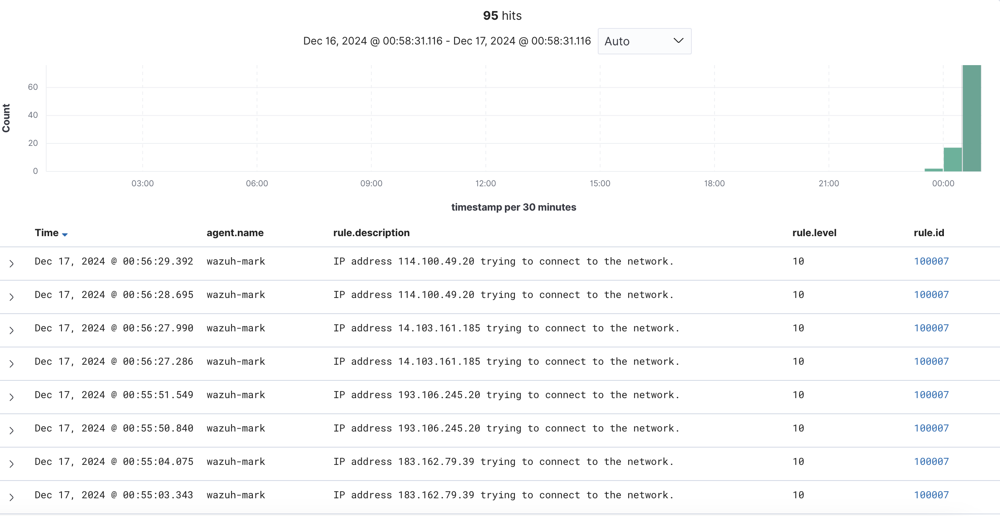
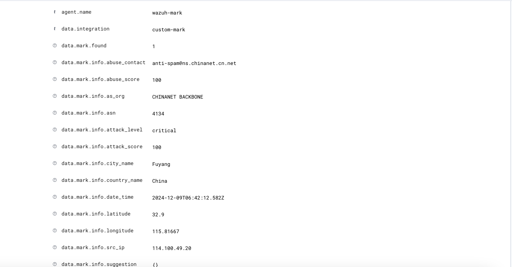

# wazuh-mark-integration

## Disclaimer
THIS SOFTWARE IS PROVIDED BY THE COPYRIGHT HOLDERS AND CONTRIBUTORS "AS IS"
AND ANY EXPRESS OR IMPLIED WARRANTIES, INCLUDING, BUT NOT LIMITED TO, THE
IMPLIED WARRANTIES OF MERCHANTABILITY AND FITNESS FOR A PARTICULAR PURPOSE ARE
DISCLAIMED. IN NO EVENT SHALL THE COPYRIGHT HOLDER OR CONTRIBUTORS BE LIABLE
FOR ANY DIRECT, INDIRECT, INCIDENTAL, SPECIAL, EXEMPLARY, OR CONSEQUENTIAL
DAMAGES (INCLUDING, BUT NOT LIMITED TO, PROCUREMENT OF SUBSTITUTE GOODS OR
SERVICES; LOSS OF USE, DATA, OR PROFITS; OR BUSINESS INTERRUPTION) HOWEVER
CAUSED AND ON ANY THEORY OF LIABILITY, WHETHER IN CONTRACT, STRICT LIABILITY,
OR TORT (INCLUDING NEGLIGENCE OR OTHERWISE) ARISING IN ANY WAY OUT OF THE USE
OF THIS SOFTWARE, EVEN IF ADVISED OF THE POSSIBILITY OF SUCH DAMAGE.

## Description

This is an example of integrating Wazuh with [MARK](https://mark-dev.opennix.org/), my personal PET project focused on security research.

For a detailed explanation of MARK’s simple architecture, check out this [overview](https://blog.pytoshka.me/post/homelab-honeypot-cluster/).

You can also learn more about its purpose and functionality in this [introduction](https://blog.pytoshka.me/post/meet-mark/) .

**Important Note**: The MARK public API and the system as a whole are experimental and intended for research purposes.

## Installation

- Clone the repository:

```bash
git clone https://github.com/pyToshka/wazuh-mark-integration.git
```

- Copy the script:
```bash
cp wazuh-mark-integration/custom-integration-mark.py /var/ossec/integrations
```


## Configurations

### Change File Permissions
```bash

chmod 750 /var/ossec/integrations/custom-integration-mark.py
chown root:wazuh /var/ossec/integrations/custom-integration-mark.py

```

### Update `local_rules.xml`

Below is an example configuration for monitoring failed SSH authentication attempts:

```xml
<group name="local,syslog,sshd,">
 <rule id="100004" level="10">
    <if_sid>5760</if_sid>
    <match type="pcre2">\b(?!(10)|192\.168|172\.(2[0-9]|1[6-9]|3[0-1])|(25[6-9]|2[6-9][0-9]|[3-9][0-9][0-9]|99[1-9]))[0-9]{1,3}\.(25[0-5]|2[0-4][0-9]|[01]?[0-9][0-9]?)\.(25[0-5]|2[0-4][0-9]|[01]?[0-9][0-9]?)\.(25[0-5]|2[0-4][0-9]|[01]?[0-9][0-9]?)</match>
    <description>sshd: Authentication failed from a public IP address > $(srcip).</description>
    <group>authentication_failed,pci_dss_10.2.4,pci_dss_10.2.5,</group>
  </rule>
 <rule id="100005" level="10">
    <if_sid>5710</if_sid>
    <match type="pcre2">\b(?!(10)|192\.168|172\.(2[0-9]|1[6-9]|3[0-1])|(25[6-9]|2[6-9][0-9]|[3-9][0-9][0-9]|99[1-9]))[0-9]{1,3}\.(25[0-5]|2[0-4][0-9]|[01]?[0-9][0-9]?)\.(25[0-5]|2[0-4][0-9]|[01]?[0-9][0-9]?)\.(25[0-5]|2[0-4][0-9]|[01]?[0-9][0-9]?)</match>
    <description>sshd: Authentication failed from a public IP address > $(srcip).</description>
    <group>authentication_failed,pci_dss_10.2.4,pci_dss_10.2.5,</group>
  </rule>
</group>

<group name="local,syslog,sshd,">
  <rule id="100007" level="10">
    <field name="mark.srcip">\.+</field>
    <description>[MARK] IP address $(mark.srcip) trying to connect to the network.</description>
    <group>authentication_failed,pci_dss_10.2.4,pci_dss_10.2.5,</group>
  </rule>
</group>


```

### Add integration to `ossec.conf`

```xml
<!-- MARK Integration -->
<integration>
    <name>custom-integration-mark.py</name>
    <hook_url>https://mark-api.opennix.org</hook_url>
    <level>10</level>
    <rule_id>100004,100005</rule_id>
    <alert_format>json</alert_format>
</integration>

```
### Restart Wazuh Manager

```bash
systemctl restart wazuh-manager
```

## Screenshots

Security events overview



Security event details


Full json log

```json
{
   "mark":{
      "found":1,
      "source":{
         "alert_id":"1734382585.371271",
         "rule":"100005",
         "description":"sshd: Authentication failed from a public IP address > 114.100.49.20.",
         "full_log":"Dec 16 20:56:24 wazuh-mark sshd[26088]: Disconnected from invalid user little 114.100.49.20 port 25513 [preauth]",
         "srcip":"114.100.49.20"
      },
      "srcip":"114.100.49.20",
      "info":{
         "src_ip":"114.100.49.20",
         "date_time":"2024-12-09T06:42:12.582Z",
         "country_name":"China",
         "city_name":"Fuyang",
         "as_org":"CHINANET BACKBONE",
         "asn":4134.0,
         "abuse_contact":"anti-spam@ns.chinanet.cn.net",
         "longitude":"115.81667",
         "latitude":"32.9",
         "attack_level":"critical",
         "attack_score":100,
         "abuse_score":100,
         "suggestion":"{}"
      }
   },
   "integration":"custom-mark"
}


```
